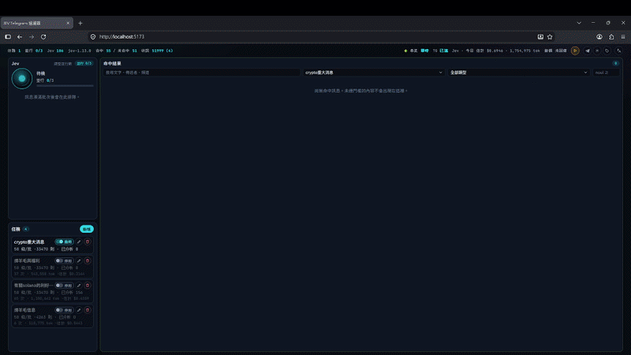
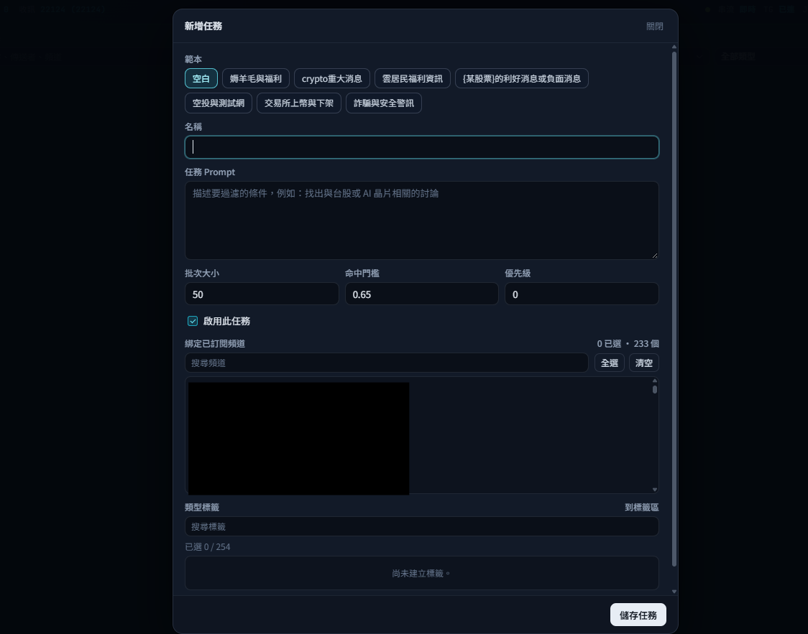
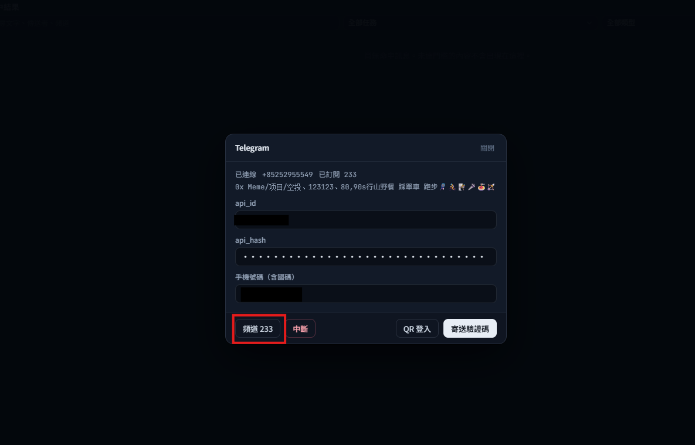
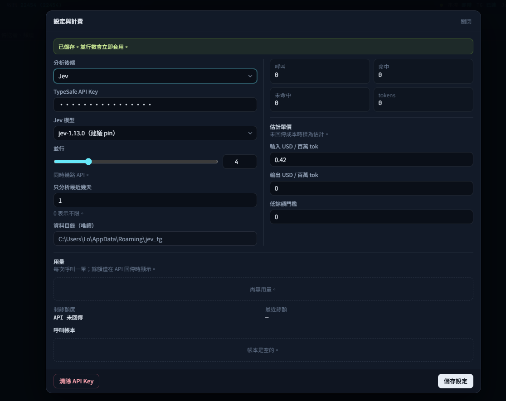

# JEV Telegram 條件過濾器



本機的 Telegram 條件過濾器。FastAPI 與 SQLite 聽在 `127.0.0.1:18721`。一個 Telegram 帳號（Telethon `StringSession`），訊息存在本機。任務把訊息分批送給 Jev（TypeSafe）或本機 Laya；新任務的預設批次大小是 50。畫面只留命中；圖片在命中之後才下載。

介面語系是 `zh-Hant`、`zh-Hans`、`en`。內建任務範本跟著目前語系。

## 設定畫面







## 使用步驟

1. 打包後是一個程式（Windows 的 `jev-tg.exe`，macOS 的 app）。系統匣選「開啟頁面」，瀏覽器開 `http://127.0.0.1:18721/`。從原始碼開發時，畫面在 `http://localhost:5173/`，API 仍在 18721。

2. 上方狀態列右側的齒輪打開「設定與計費」。要用 Jev，填 TypeSafe API Key；存檔後欄位以圓點遮住。分析後端選 Jev 或 Laya，按「儲存設定」。從原始碼跑 Laya 才要 `uv sync --extra laya`；打包檔用的是該次建置已包含的後端。同一頁可調「並行」，以及「只分析最近幾天」（0 表示不限）。

3. 同一列、齒輪左邊的 Telegram 圖示打開登入視窗。一個帳號：填 `api_id`／`api_hash`，再用「QR 登入」（手機：設定 → 裝置 → 連結桌面裝置）或填手機號碼後「寄送驗證碼」。有兩步驟驗證時再填雲端密碼。登入後會同步對話。按「頻道 N」進入「頻道勾選」，勾要聽的頻道；清單不對時按「重新同步」。搜尋後「全選」只勾目前列出的項目，「清空」取消全部勾選。按「完成」才會儲存並關閉。只有已訂閱的頻道會收訊。任務表單列出的是這些已訂閱頻道，不是全部對話。

4. 齒輪右邊的標籤圖示管理全域標籤。每個任務最多選 254 個。`other` 是保留項，呼叫時自動加上。

5. 左欄「任務」按「新增」。範本芯片只填名稱和 Prompt；「空白」清掉這兩欄。批次大小預設 50，並填「命中門檻」。在「綁定已訂閱頻道」勾選，可用「全選」和「清空」。再選標籤，按「儲存任務」。任務卡上的開關要在「啟用」。

6. 狀態列右側、Telegram 圖示左邊是分析開關。兩條直槓表示正在分析（「暫停分析」）；三角形表示已暫停，按下去是「啟動分析」。暫停時仍繼續收訊。訊息要湊滿該任務的批次大小，而且落在天數視窗內，才會排進佇列。佇列在左欄引擎卡片裡，Jev 或 Laya 標題下方。

7. 命中出現在右欄「命中結果」，圖片在文字上面。往下捲可看較早的命中。搜尋，以及依任務、類型、最低 noul 的篩選，都在伺服器套用。未命中不會列出。

8. 任務卡的「N 則 · 已分析 M」是這個任務綁定的已訂閱頻道、且落在天數視窗內的則數，以及其中已分析的則數。

## 開發

需要 Python 3.11+、[uv](https://docs.astral.sh/uv/)、Node.js 20+。Telegram 的 `api_id` / `api_hash` 向 [my.telegram.org](https://my.telegram.org) 申請。TypeSafe API key 在設定頁寫入後端。

在專案根目錄啟動後端：

```powershell
uv sync
uv run python -m server
```

另開一個終端啟動前端。開發時瀏覽器開 `http://localhost:5173`（Vite 綁定 `[::1]`）。`/api`（含 SSE `/api/events`）會代理到 FastAPI。

```powershell
cd web
npm install
npm run dev
```

資料目錄預設是專案裡的 `data/`。要用別的路徑時設定 `JEV_TG_DATA_DIR`。設定頁還沒寫入金鑰時，後端會讀環境變數 `TYPESAFE_API_KEY`。

Laya 是選用本機模型，權重不在這個 repo。需要時再裝，第一次判斷才會下載：

```powershell
uv sync --extra laya
```

## 系統匣

系統匣開的仍是同一個網頁介面。選單會開 `http://127.0.0.1:18721/`，也可以結束程式。

本機先建好前端，再啟動系統匣：

```powershell
cd web
npm run build
cd ..
uv run --extra tray python -m server.tray
```

打包後的資料目錄：Windows 是 `%APPDATA%\jev_tg`，macOS 是 `~/Library/Application Support/jev_tg`。開發時資料仍在 `data/`，一樣可用 `JEV_TG_DATA_DIR` 覆寫。

## 自動發布

`.github/workflows/package.yml` 在 push 到 `main` 或 `master` 時，建出 Windows `jev-tg.exe` 與 macOS `JEV-Telegram-Filter.dmg`。兩個檔案都在時，會打 tag `vYYYYMMDD.HHMMSS` 並發布 GitHub Release。也可以手動跑 `workflow_dispatch`。commit 訊息含 `[skip release]` 會略過這次發布。

## 不要提交

這些已在 `.gitignore`，不要上傳：

- `data/`（SQLite 裡有 API key，還有工作階段與設定）
- `.env` 與 `.env.*`
- Telegram session 檔（`*.session`、`*.session.txt`）
